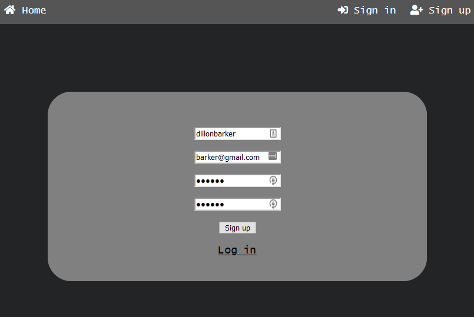
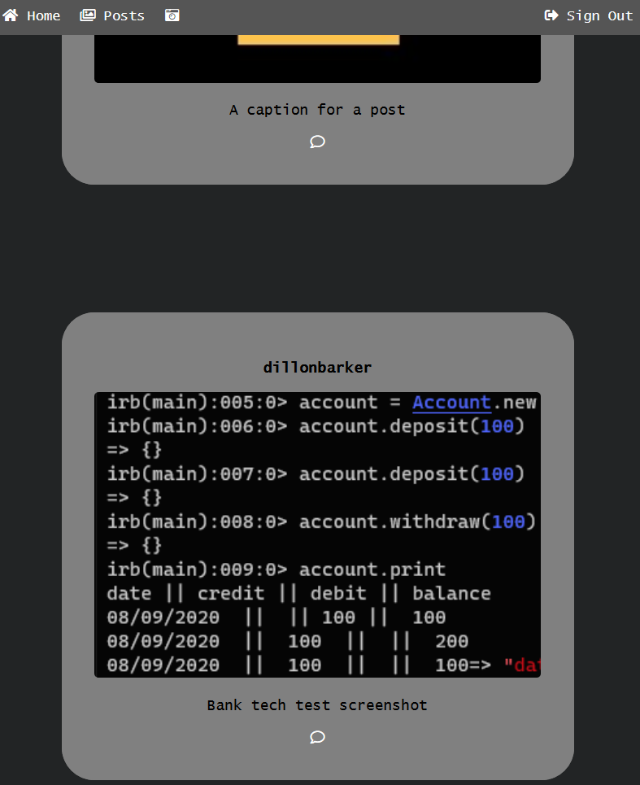
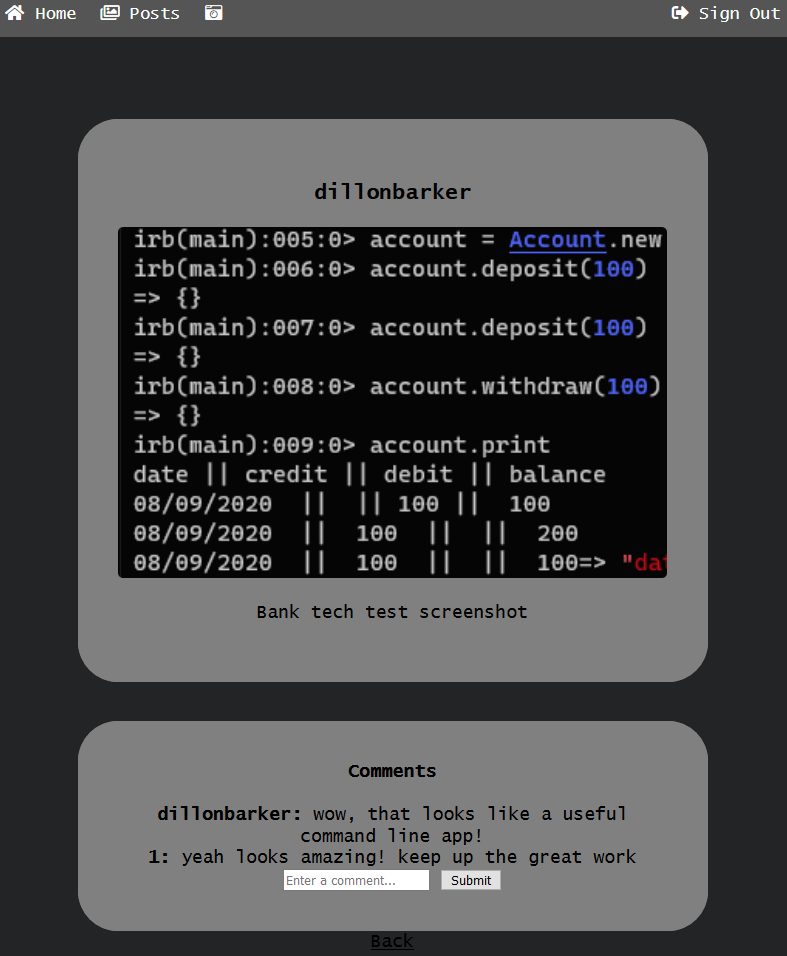

Instagram Challenge
===================

## How to use
* Firstly clone this repo
* Then run `bundle`
* Now if you run `rspec`, the tests should run alongside coverage reports

## Technologies used
* I used simplecov to ensure I was testing enough of my code line by line
* I used RSpec as a testing framework

## Outline
* Build an instagram clone where users can
  * post pictures
  * write comments on the pictures
  * have appropriate styling (like instagram does)

## The site
### Signing up


### Posts page


### Individual post page, with comments


## User stories
```
A user can sign in
A user has a username, email and password
They are greeted on sign in

A user can sign up if they do not have an account
They must have a password and confirm it

A user can post a picture
A picture can be found using a browse menu locally

A user can add a caption to a picture that they upload
They can see the caption by the picture that they upload

A user knows what is theres and what is someone elses
Posts are displayed with usernames present

A user can comment on a post
The comment displays their name
```

Stretch goals
```
A user can delete, update etc posts
This is only availible for a short time after making the post or comment

A user can like a post
The likes counter is displayed on the post
```